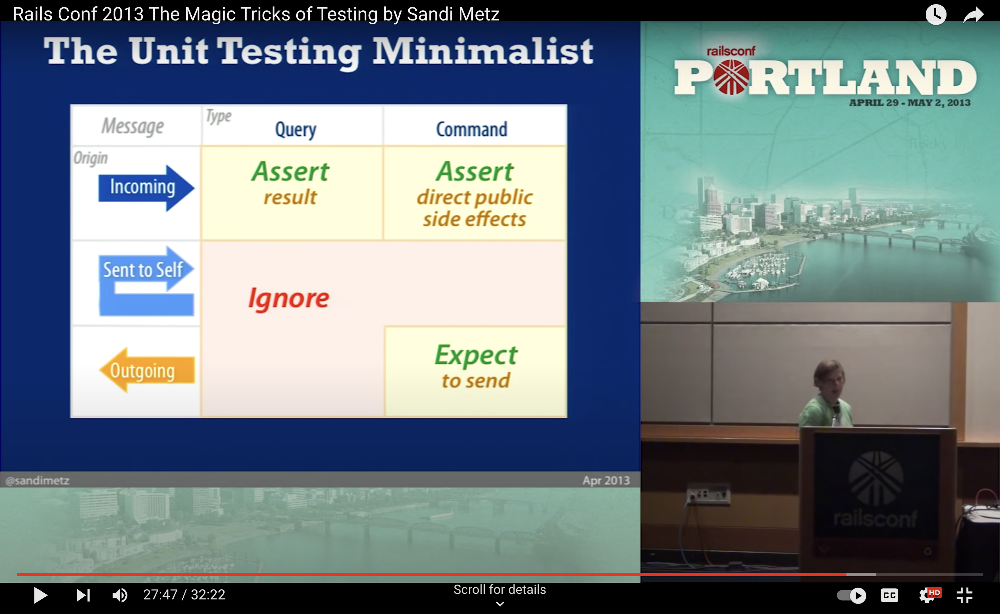

# Battle Sandwich
It's like Battleship... only tastier!

## Key Learnings
- First project built using TDD
- *What* to unit test:
  -  
- Jest --coverage

## Reminders
- Jest config
- Babel config
- Webpack config
