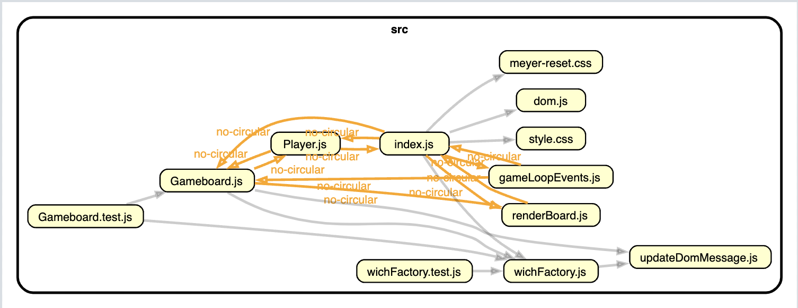
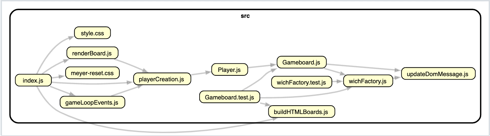

# Battle Sandwich
It's like Battleship... only tastier!
- [Assignment outline](https://www.theodinproject.com/lessons/node-path-javascript-battleship)

## Key Learnings
- Using a FIFO queue (array) to plan the computer's attack plan.
- First project built using TDD
- *What* to unit test:
  -  
- Jest --coverage

## Additional learning

- I found a dependecy mapper to expose circular module depedencies to help me resolve structural issues.
- Initial dependency map:

- Restructred:

## Reminders
- JS Set object
- Jest config
- Babel config
- Webpack config
- Try/Catch error handling
- Async/await useful for player turn in game loop.
